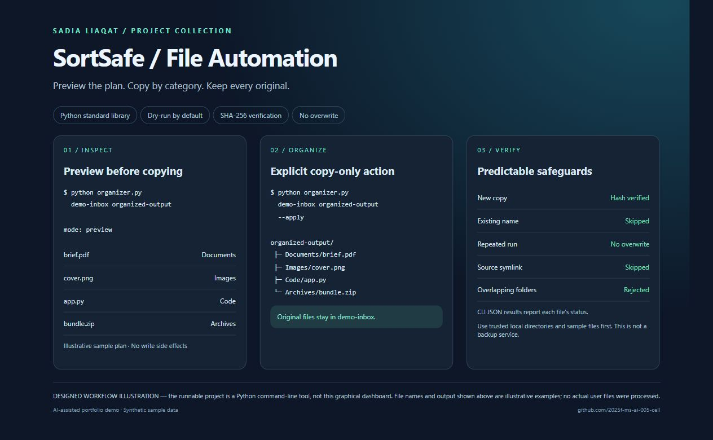

# SortSafe — Python File Organizer

**Preview first. Copy safely. Keep your originals.**

A dependency-free Python automation portfolio project prepared for Sadia Liaqat with AI assistance. Organizes top-level files into Documents, Images, Code, Archives and Other. No source files are moved or deleted.

## Visual overview



This designed overview illustrates the CLI workflow; it is not a shipped graphical application. The runnable product is the Python command-line tool below.

## Run

Python 3.10+; no packages, credentials or cloud services required.

```sh
python organizer.py "demo-inbox" "organized-output"
python organizer.py "demo-inbox" "organized-output" --apply
python -m unittest -v
```

Use a small disposable sample folder first. The first command only prints a JSON plan. `--apply` copies with exclusive target creation and SHA-256 verification; existing filenames are skipped. Repeated runs do not replace existing files.

## Engineering decisions

- Preview mode has no filesystem write side effects.
- Source and destination must be non-overlapping directories.
- Hidden files, subdirectories and source symlinks are skipped.
- Streaming copy and hash computation avoid loading large files into memory.
- A failed newly created copy is removed; existing target files are never deleted.
- Per-file errors are reported and produce a non-zero CLI exit status.

## Boundaries

This is not a backup system. No recursive processing, scheduler, cloud sync, rollback manifest or GUI. Use trusted local folders: path checks are not a security boundary against concurrent malicious filesystem changes. A source changing during a copy can fail verification. Back up important data independently.

## Verification

See [VERIFICATION.md](VERIFICATION.md). Six tests cover preview safety, copies, collisions, path overlap, filtering and repeated execution.

[Discuss a paid mobile project with Sadia](https://www.linkedin.com/in/sadia-liaqat-493998398/)

